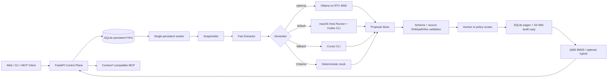
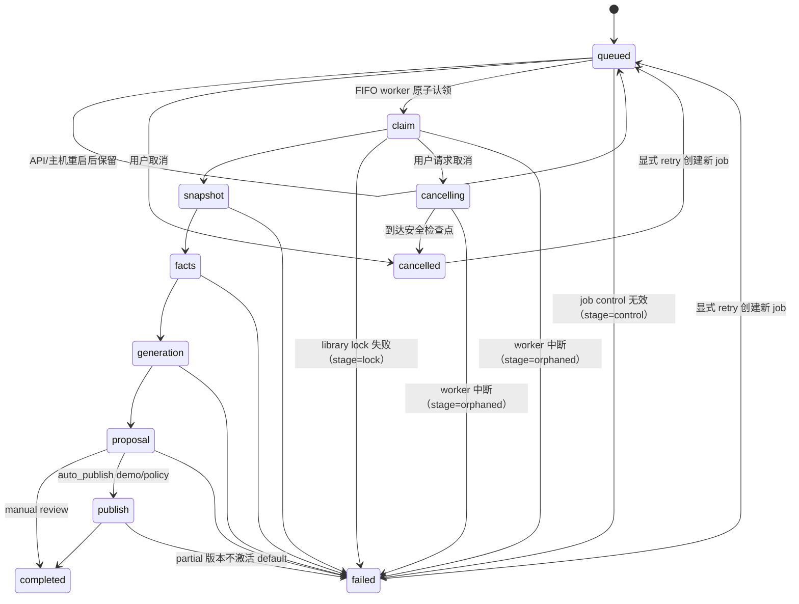

# 架构与流水线

## 核心原则

1. **源码快照不可变**：同一个 `source_sha` 的内容不原地修改。
2. **事实与叙述分层**：签名、符号、测试、示例和引用由确定性步骤先提取；LLM 只在证据边界内组织说明。
3. **写入时解析实体**：库、版本、页面与源码引用在 ingest/publish 时建立 ID；当前 symbol ID 仍是 path/line/name，跨版本稳定 symbol 是演进项。
4. **提案先于发布**：模型输出进入 proposal，schema 与 source SHA/path/line 在发布前检查；Wiki 内链是发布后 lint warning，示例执行尚未实现。
5. **发布页是知识入口，检索是导航层**：用户查询命中文档页；需要细节时再沿 `source_refs` 返回源码。
6. **Git 是审计副本**：发布历史和比较可用普通 Git 工具理解。当前 API 从 SQLite page 记录读取正文，单独 `git checkout/revert` 不会改变运行时结果，也没有自动 reconcile。
7. **最小权限与最小上下文**：模型只看到筛选后的 evidence pack；索引/MCP 不需要拿到生成模型或 Codex 凭据。

## 组件



### Control Plane（API）

- 记录 library、version、job、proposal、publish 状态。
- 固化仓库、调度抽取与生成。
- 提供 Web UI 使用的 HTTP API。
- 封装 QMD 查询，并提供 QMD 不可用时的词法降级。

当前实现使用 SQLite 持久 FIFO 与单并发 dispatcher。API 只提交 `queued` 行和不可变 request；
worker 按 `queue_seq` 原子 claim，因此尚未开始的任务在 API/主机重启后仍会继续排队。中断时已经
处于 `running/cancelling` 的任务不会从未知副作用位置自动续跑，而是在启动恢复时 fail-closed 为
`failed/orphaned`。用户可取消 queued/running job，并对没有 proposal 副作用的 failed/cancelled
job 创建带 `retry_of/attempt` 的新重试记录。它是可靠的单主机队列，但不是跨主机 lease 或分布式
调度系统。

### Snapshotter

- 本地目录：若检测到 Git，source 必须正好是仓库顶层、使用独立 standalone `.git` 目录并按
  确定 commit 归档；非 Git 目录在复制前、复制结果、复制后比较内容摘要，源目录变化即失败。
- Git URL：以 `clone --no-checkout --filter=blob:none` 取得对象，解析唯一 commit 后直接
  `git archive`；不执行被分析代码，也不依赖 checkout worktree。
- 默认跳过 `.git`、依赖缓存与常见构建产物；symlink 受边界检查。
- 写入 `snapshot.json`，记录 source、source kind、`source_sha`、ref、创建时间与检测到的 `skipped_sensitive` 路径。忽略目录集合目前由代码版本决定，并未逐项固化到 metadata。

Git archive 在固化前检查 mode `160000` submodule、Git LFS pointer、重复/特殊/越界 member，
以及 NFC + casefold 后的便携路径冲突；任何一项都拒绝。需要 monorepo 子树、submodule 或 LFS
内容时，先在宿主完全物化，再把所需 worktree/子树复制到 allowlist 中一个不含父 `.git` 的
普通目录，不能直接把 package 子目录伪装成 Git 根。

本地 Git 还拒绝 linked worktree/`.git` pointer、非普通 `.git/config`、`commondir`、alternate
object store，以及解析后逃出仓库根的 metadata/object path。所有 source Git 子进程先删除继承的
全部 `GIT_*` 变量，再注入受控环境，避免调用方覆盖 git-dir/config/object 行为。

当前 fact/evidence 提取会按常见敏感目录、文件名与后缀跳过 `.env`、私钥、凭据等，并在 manifest 记录 `skipped_sensitive`；为了保持 `source_sha`，原文件仍留在只读 snapshot。它不是内容级 secret scanner，导入前仍必须确认目标 commit/目录可以进入受保护的数据区。

### Fact Extractor

优先使用 `universal-ctags --options=NONE --links=no --output-format=json`；这样不读取
仓库/用户的 ctags options，也不跟随链接。不可用时使用内置语言规则降级。事实层至少包含：

- public-ish 符号的名称、kind、签名、docstring、文件与行号。
- 每个文件的路径、大小、SHA-256、语言与 role。
- 按优先级收集 README、现有 docs、tests、examples、manifest 与源码片段。
- 有总字节上限的 evidence pack。

事实并不等于最终文档，但所有可验证陈述都应能回到事实或源码。

### Generator

Generator 接受：

- library/version 元数据；
- 目标页面 schema；
- 事实包；
- 允许引用的源码片段；
- 现有 Wiki 页面（更新时）；

输出是结构化页面提案，而不是直接写 published Wiki。当前会规范化页面字段，拒绝绝对/越界路径，并把每页 `source_refs` 绑定到该 provider 生成时实际可见的 evidence/symbol 行范围；发布时还会拒绝敏感文件名、symlink、错误 snapshot SHA 和无效行范围。它仍不验证某个 claim 是否真的由那几行语义蕴含。

### Proposal / Review

proposal 是不可发布的中间态。当前实现与演进检查门如下：

| 检查 | 当前状态 | 失败后动作 |
|---|---|---|
| 生成 JSON Schema | 已实现（Ollama/Codex 结构化输出） | job 失败 |
| `source_sha` 与目标版本一致 | 已实现 | 页面不发布 |
| `path:line_start-line_end` 存在且范围有效 | 已实现 | 页面不发布 |
| 引用属于本次生成实际可见的 evidence/symbol 范围 | 已实现 | 页面不发布 |
| 敏感路径与 symlink 引用拒绝 | 已实现 | 页面不发布 |
| 安全相对路径、重复页面 | 已实现 | job/publish 失败 |
| typed index/sidecar、孤儿页、Wiki 内链 lint | 已实现；部分为 warning | 返回 lint issues |
| 示例命令在隔离容器通过 | 演进设计 | 按库策略阻断 |
| 变更规模阈值、审批身份、双人审核 | 演进设计 | 强制人工确认 |

### Published Wiki

发布树同时保存 Markdown 与 JSON sidecar：

```text
/data/wiki/acme-widget/
├── .git/
├── README.md
└── versions/v1.4.0-git.3ac10e1f42ab--1913fc1996/
    ├── index.md
    ├── index.json
    ├── log.md
    ├── overview.md
    ├── api/
    │   └── client-create.md
    ├── guides/
    │   └── authentication.md
    └── facts/
        ├── overview.json
        ├── api/client-create.json
        └── guides/authentication.json
```

Markdown 适合人和检索器；JSON 适合校验、图谱与未来的增量处理。单页 publish 先提交 Git，再提交 SQLite；SQLite 失败时会在 library publish 锁内把 Git 回滚到前一 commit。进程被强杀、磁盘损坏等跨介质崩溃仍不是 ACID 事务，`lint` 会报告漂移。API/runtime 正文以 SQLite page 记录为准，Git 只是审计副本：直接修改或 revert 工作树不会同步到查询结果，当前也没有自动 reconcile 命令。

Wiki Git repo 同样按不可信恢复数据处理：每次 Git 调用前都忽略 system/global config，并把
service-owned `.git/config` 重写为最小本地配置，禁用 hooks、fsmonitor、外部 attributes 与
credential helper；`.git` 和 config 不允许是链接。该规范化不能验证 archive 来源，因此只恢复
受信任的完整备份，不能把 SHA-256 sidecar 当签名。

version 目录名是物化 version 的 slug 加该 version 字符串 SHA-256 前 10 位，不是公共 API；
脚本应使用 API 返回的 `wiki_path`，不要自行拼接。

`auto_publish=true` 在一个 publish barrier 内逐页写入，但只有全部 proposal 成功后才一次性激活 `default_version`。中途失败的已写页面保留为 `partial` 版本，不会替换旧默认版本；这是可恢复的分阶段发布，不是全版本单 commit。

人工审核也使用整版激活门：每次批准会物化单页，但只有同一 version 的全部 proposal 都已
published 且没有 rejected 时，最后一次批准才更新 `default_version` 并建立 QMD 索引；任何 reject
都会让未激活版本进入 `rejected` 或 `partial`。

### QMD Retrieval

QMD 提供：

- SQLite FTS5/BM25：精确 API 名称、错误码、参数名非常有效。
- 本地向量：自然语言意图到文档段落。
- Query expansion 与 reranker：处理概念同义与较长问题。
- collection/context：按 library/version 限定。

LCF 当前让 QMD 索引发布 Wiki，但 API 会把检索命中映射回 SQLite 中的发布 page 记录。把事实层作为独立 collection、按需“下钻到证据”是后续扩展，默认不让原始代码块淹没文档结果。

所有 collection 注册、刷新、删除和 rebuild 经过同一个跨进程 QMD writer lock。embedding 模型
与 corpus revision 是全局 profile：更换模型或发布新 corpus 会把状态标为 stale。Web/API 创建
`embedding_rebuild` 后，worker 注册完整 published corpus 并以目标模型执行全局 `embed -f`；
成功且 corpus revision 未变化时才原子切换 active model。此前以及失败/取消时查询使用 lexical
fallback，不会把旧模型向量冒充新 profile。索引重建不调用生成模型；重新 ingest 才会消耗
Codex/Cursor/Ollama。

### MCP Gateway

MCP 只依赖 API，不直接接触生成模型或源码写权限。它暴露：

- `resolve-library-id`：把名称/slug/版本提示解析为稳定 library ID。
- `query-docs`：在已发布 Wiki 中检索并返回带版本、页面与来源的信息。

这让 Claude Desktop、Codex CLI、IDE 或其他 MCP 客户端使用同一份知识库。

## 当前 ingest 状态流



失败 job 保留脱敏错误；缺失/损坏的 job control 会 fail closed，不会改用 library 的新 source 或
默认 HEAD。`queued` 是可恢复队列状态，重启后继续；只有已经被 claim 的 `running/cancelling`
无法证明安全续跑，才按 owner runtime lock 进入 `failed/orphaned`。显式 retry 会创建新 job 并
递增 attempt，旧记录保持不变；为避免重复 CLI 消耗和重复发布副作用，系统不会盲目自动重试。
队列响应提供 `queue_position/cancellable/retryable`，Web 可直接取消或重试。

## 演进设计：增量更新（当前未实现）

当前每次 ingest 都会重新抽取事实并为本次版本全量生成提案。目标增量算法是：

1. 比较旧、新 `source_sha` 的 Git diff。
2. 找出改变的符号、测试、文档和依赖。
3. 通过 sidecar 的 `source_refs` 找到受影响页面。
4. 只为受影响页面生成提案，并保留未变页面。
5. lint 全局内链与索引。
6. Git commit 发布并推进全局 corpus revision；随后由独立 rebuild job 刷新完整向量空间。

若无法可靠计算影响范围（例如生成器版本或 schema 大改），回退为全量重建，但仍保留旧版本目录。

## 故障隔离

- Ollama 不可用：当前 job 失败并保留错误；检索与 MCP 继续服务旧 Wiki，恢复后重新 ingest。
- QMD 模型未下载或 profile stale：API 使用 lexical fallback；全局 rebuild 成功后才使用 hybrid。
- 模型生成非法 JSON：job 记录脱敏错误且不污染 Wiki；当前不持久化 raw model output，若要排查须在受控环境复现。
- Git 初始化/提交失败：proposal 仍存在；首次初始化中断可重试。SQLite 提交失败会尝试补偿回滚刚创建的 Git commit，`lint` 负责发现强杀窗口遗留的漂移。
- auto publish 中途失败：旧 default 保持不变，job 指明已写页数，新版本标记 `partial`。
- Web UI 不可用：HTTP API、脚本和 MCP 仍可工作。

这种分层让“文档生成失败”不会升级为“已有知识库不可查询”。
