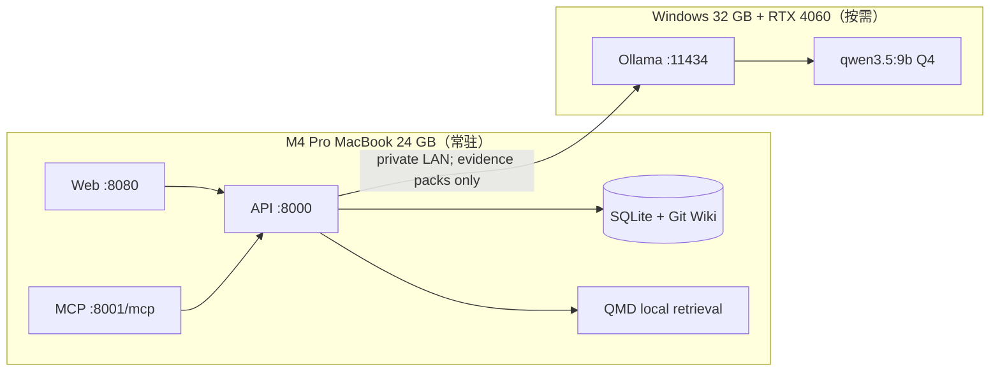

# M4 Pro 24 GB + 可选 Windows 32 GB / RTX 4060 部署

## M4 Pro 24 GB 推荐基线

首选 [all-in-one 安装器](14-all-in-one-macos.md)：Compose 常驻 API/MCP/Web/索引，
macOS LaunchAgent 调用已登录 Codex CLI，Cursor 只作备用。默认 worker 并发保持 1，
避免 Wiki 生成、embedding 与浏览器同时争抢统一内存。EmbeddingGemma 300M Q8
适合作为起点；先完成 BM25 验收，再显式重建 hybrid 向量。

Docker Desktop 和 Colima 都可使用。Colima 新 profile 可从 6 CPU、8 GiB 内存、
80 GiB 磁盘起步；安装器只启动当前已有 profile，不调整其资源。

## 推荐：检索与生成分机



这套拆分把常用查询留在安静、低功耗的 Mac，把批量 Wiki 生成交给 4060。Windows 关机时，已发布 Wiki、QMD 查询和 MCP 仍然可用；当前参考实现中的新 Ollama job 会失败并保留错误，Windows 恢复后需要重新发起 ingest。

## 资源预算

### Mac

| 组件 | 典型资源 | 建议 |
|---|---:|---|
| API + MCP + Web + SQLite | 0.5–1.5 GB RAM | 可常驻 |
| QMD EmbeddingGemma | 模型约 300 MB | 启用 hybrid 后的英文代码库默认 |
| QMD reranker | 模型约 640 MB | 查询时加载 |
| QMD query expansion | 模型约 1.1 GB | 查询时加载 |
| Docker Desktop VM | 4–8 GB 配额 | 先给 8 GB，内存压力大再降 |
| Wiki/source/index | 取决于仓库 | 预留源码总量 2–4 倍磁盘 |

LCF 在全局 embedding profile ready 前使用内置 lexical fallback。QMD 官方 README 当前列出的
hybrid 默认本地模型是上述三项，并要求 Node.js 22+；macOS 原生安装还需要 Homebrew SQLite。
首次全局 rebuild/query 会下载模型，需预留约 3 GB 缓存与可用网络。

### Windows / 4060

多数移动版或桌面版 RTX 4060 为 8 GB 显存。9B 级 Q4 生成模型通常可以作为起点，但上下文 KV cache 与具体量化会决定是否溢出。建议：

- 模型：先试 `qwen3.5:9b`；本机 Ollama 无该 tag 时，改用你可获得的 7B/8B code/instruct 模型。
- 并发：`OLLAMA_NUM_PARALLEL=1`。
- 模型 payload：先把 `LCF_MAX_MODEL_EVIDENCE_BYTES` 控制在约 18–30 KiB，并给总 payload 设硬限，避免把持久 facts 包直接塞入上下文。
- 上下文：先 8K–16K；观察 `nvidia-smi` 后再增加。
- Windows 32 GB 系统内存允许部分 CPU offload，但速度会明显下降。

模型名和量化会随 Ollama 目录变化；部署脚本会先执行 `ollama pull`，失败时保留明确错误，不会悄悄切换模型。

## 两种 Mac 运行方式

两条路径共同需要 Git、`curl`、`tar`、`jq`、Python 3 与 `rsync`；Compose 还需要 Docker
Desktop/Compose v2，native 还需要 Homebrew、Node 22、Homebrew SQLite 与 Universal Ctags。
先用 `./scripts/macos-bootstrap.sh --check`（native 用 `--native --check`）核对，不会安装软件。

### A. Docker Compose（最容易复现）

```bash
test -f .env || cp .env.example .env
docker compose up -d --build
```

优点：依赖隔离、升级/回滚简单、统一 healthcheck。限制：Docker Desktop 的 Linux VM 通常不能直接使用 Apple Metal，容器内 QMD 的 GGUF 推理可能走 CPU。对默认小模型和中小仓库仍可用，但首次 embedding 与 hybrid query 会慢于原生。

### B. macOS 原生控制面（追求 QMD/Metal 性能）

```bash
./scripts/macos-bootstrap.sh --native
make dev-native
```

`dev-native.sh` 会同时启动三个进程、给出分服务日志、任一子进程退出时终止整组，并在 Ctrl-C
时清理。它与 Compose 一样读取 `.env`。`LCF_QMD_HYBRID_ENABLED` 是部署级总开关，
all-in-one 默认允许 hybrid，但不会自动下载模型；首次向量构建仍由用户在 Web 明确提交。
日后的模型选择与重建都在 Web 管理，不再反复修改 `.env`。默认 embedding URI 为
`hf:ggml-org/embeddinggemma-300M-GGUF/embeddinggemma-300M-Q8_0.gguf`。profile ready 前查询
保持 lexical fallback；publish 不同步下载模型或构建向量。原生 `node-llama-cpp` 更可能使用
Apple Silicon 加速。

bootstrap 把 QMD 2.5.3 安装到项目的 `.native/node_modules/.bin/qmd`；`dev-native.sh` 会显式
加入 Homebrew keg-only `node@22` 的路径，不依赖 bootstrap 子进程结束后仍保留 `PATH`。
`make qmd-embed-native` 本身不启动 QMD CLI，只请求已经运行的 API。

发布 demo/自己的 Wiki 后，在 Web 提交全局索引重建。`make qmd-embed-native` 与
`make qmd-embed` 只是资深用户的同步诊断入口，都会调用当前 `LCF_API_URL`，名称不会替你选择
runtime。执行时必须确认只有目标 API 在 `127.0.0.1:8000` 运行。native API 使用
`data/qmd/native-config`/`native-cache`；Compose API 使用 `data/qmd/config`/`cache`。切换模式后
要先关闭旧 runtime，再启动目标 runtime，并在 Web 重新提交全局 rebuild。

不要让 Docker 和原生实例同时写同一个 `/data` 目录；SQLite、Git publish 与 QMD update 都应保持单写者。

## Windows Ollama 安全配置

Ollama 默认只监听本机。为了让 Mac 访问，需要监听 LAN，但**不能直接把 11434 暴露给所有网络**。

1. 在 Mac 查询私网 IP：

   ```bash
   ipconfig getifaddr en0
   ```

2. 用管理员 PowerShell 执行：

   ```powershell
   Set-ExecutionPolicy -Scope Process Bypass
   .\scripts\windows-ollama-setup.ps1 `
     -MacAddress 192.168.1.20 `
     -Model qwen3.5:9b `
     -InstallOllama `
     -RestartOllama
   ```

3. 脚本会：

   - 设置用户级 `OLLAMA_HOST=0.0.0.0:11434`；
   - 设置 `OLLAMA_NUM_PARALLEL=1`；
   - 创建只允许指定 Mac 私网 IP 入站的 Windows Firewall 规则；
   - 拉取并检查模型。

4. 重启 Ollama；在 Mac 验证：

   ```bash
   curl --fail http://WINDOWS_PRIVATE_IP:11434/api/tags
   ```

5. 修改 `.env`：

   ```dotenv
   OLLAMA_BASE_URL=http://192.168.1.50:11434
   OLLAMA_MODEL=qwen3.5:9b
   OLLAMA_NUM_CTX=16384
   OLLAMA_NUM_PREDICT=4096
   LCF_MAX_MODEL_PAYLOAD_BYTES=60000
   LCF_MAX_MODEL_MANIFEST_BYTES=8000
   LCF_MAX_MODEL_SYMBOLS_BYTES=16000
   LCF_MAX_MODEL_EVIDENCE_BYTES=18000
   LCF_MAX_EXISTING_WIKI_BYTES=12000
   ```

`.env.example` 保留 32K context、8K output、100 KB 单次模型 payload 与 30 KB evidence component 的高覆盖默认值。`LCF_MAX_EVIDENCE_BYTES=240000` 控制磁盘上持久 facts/evidence 包，不等于发送给模型的上下文；实际 outbound payload 受 `LCF_MAX_MODEL_PAYLOAD_BYTES` 总硬限和各 component budget 二次裁剪。对常见 8 GB RTX 4060，上述 16K/4K/60 KB 是更稳妥的首跑配置；确认显存与生成完整度后再逐步提高。

6. 只重建/重启 API：

   ```bash
   docker compose up -d --build api
   ```

### 网络基线

- Windows 网络配置文件设为 **Private**；脚本的规则只应用 Private。
- `-MacAddress` 必须是单个 Mac IPv4 地址，且只能属于 RFC1918
  （`10/8`、`172.16/12`、`192.168/16`）或 `100.64/10` 隧道范围；当前 Ollama listener
  绑定 `0.0.0.0`，脚本明确拒绝公网、IPv6、CIDR、loopback、multicast、
  `255.255.255.255` 与 `Any`。
- 路由器不要设置 11434 端口映射；不要用公网 DDNS 暴露。
- 家庭/办公网不可信时，使用 Tailscale/WireGuard，并把防火墙 RemoteAddress 限制为隧道 IP。
- Ollama HTTP 本身不等同于带鉴权的多租户 API。需要跨不可信网络时，在前面加 mTLS/auth proxy，而不是只靠“隐藏 IP”。
- evidence pack 仍含源码片段。Windows 主机也应按源码敏感级别管理磁盘、日志和用户权限。

## 仅用一台机器

### 只用 M4

- 检索：先用 QMD BM25；需要更高召回时再启用 QMD 默认 hybrid 模型。
- 生成：Ollama 的 3B–7B Q4，或 `mock` + 人工完善。
- 避免同时跑大型生成和 embedding；让 job 串行。

### 只用 Windows

可在 WSL2/Docker Desktop 跑整个 Compose，把 `/data` 放在 WSL 的 ext4 文件系统，而不是 `/mnt/c`，以改善大量小文件、Git 和 SQLite 性能。MCP/UI 端口仍建议绑定 `127.0.0.1`。

## 性能调优顺序

1. 先减少 outbound model payload/component budgets 和生成并发。
2. 缩小库边界与持久 evidence 包；“只更新受影响页面”的增量 ingest 是演进方向，当前参考实现每次仍会全量生成提案。
3. QMD 先 `search`/BM25，再为高价值查询使用 `query`。
4. 对 QMD embedding 使用 `--chunk-strategy auto` 和较小 batch。
5. 再考虑换更大的 embedding/generation 模型。

模型变大不一定修复事实错误；证据质量、页面 schema、测试示例与 review gate 通常更重要。
