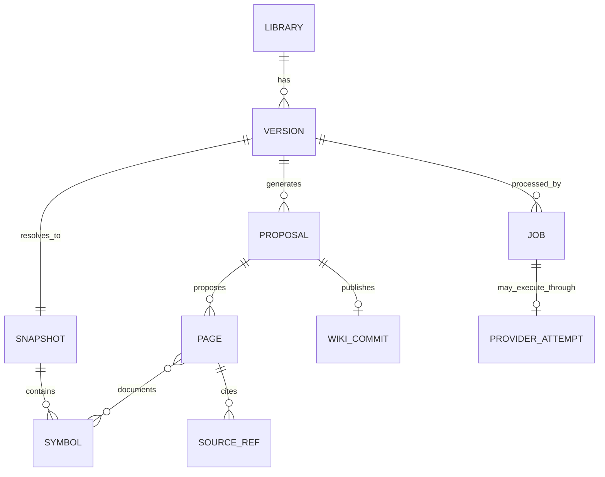

# 数据模型与磁盘布局

## 数据根目录

以下 `/data` 图是 legacy Docker/native domain 的逻辑布局。Electron 把同一类 domain 文件
放在 `~/Library/Application Support/Local Context Forge/`，并另用
`~/Library/Caches/Local Context Forge/qmd-runtime/` 和 per-launch temp。当前 desktop 的精确
实现、ADR-0004 目标差距和 backup 限制见[系统设计的数据章节](17-system-design.md)。

Legacy 默认 `LCF_DATA_DIR=/data`，Compose 把宿主机 `./data` 绑定到这里：

```text
/data/
├── metadata.sqlite3
├── sources/
│   └── <library-key>/<source-sha>/repo/...
├── facts/
│   └── <library-key>/<source-sha>/
│       ├── manifest.json
│       ├── symbols.json
│       └── evidence.json
├── proposals/
│   └── <job-id>/
│       ├── overview.md
│       ├── api/...
│       └── facts/...
├── wiki/
│   └── <library-slug>/
│       ├── .git/
│       └── versions/<slugified-version>--<version-sha256-10>/...
├── jobs/
│   ├── <job-id>.json
│   └── <job-id>.validation.json
├── runner/
│   ├── inbox/
│   ├── working/
│   ├── outbox/
│   ├── failed/
│   └── heartbeat.json
├── locks/
│   └── <library-hash>.<operation>.lock
├── qmd/
│   ├── config/
│   ├── cache/
│   ├── native-config/
│   └── native-cache/
```

`jobs/` 是可恢复的控制/审计状态，必须与 SQLite 一起备份。`locks/` 中是不承载业务数据的
advisory lock 文件（Windows byte-range lock 可能写一个占位 byte）：文件会保留并可重建，是否
存在不表示当前有人持锁；实际锁随进程退出而释放。
QMD cache/index 可以重建；其余目录共同构成可恢复状态。不要只备份 SQLite 而忽略 Wiki Git、
源码快照与 job 控制文件。

上图的 `runner/` 是 legacy host-runner spool。共享 `Settings` 也会在 desktop 数据根创建
`runner/inbox/` 和 `runner/outbox/` 兼容目录，但当前 desktop provider 不通过它执行：
desktop attempt 的 bounded evidence 位于
`~/Library/Application Support/Local Context Forge/provider-attempts/<job-id>/`，状态权威记录
在 SQLite `provider_attempts` 表。不要把 `runner/` 当作 desktop provider attempt 的恢复依据。

当前 API/runtime 的 page 正文来自 SQLite，Wiki Git 是同步生成的审计副本，不是可独立切换的运行时权威源。两者都要一致备份；直接编辑/revert Git 不会更新 SQLite，当前没有自动 reconcile。

## 核心实体

### Library

```json
{
  "id": "1f9a...",
  "name": "widget",
  "slug": "acme-widget",
  "context7_id": "/local/acme-widget",
  "source": "https://github.com/acme/widget.git",
  "description": "Widget SDK",
  "default_version": "v1.4.0+git.3ac10e1f42ab",
  "created_at": "2026-07-28T10:00:00Z",
  "updated_at": "2026-07-28T10:00:00Z"
}
```

约束：

- `id` 是内部随机 ID；MCP 公开使用 `context7_id`。
- `slug` 与 `context7_id` 唯一；同名库会得到不同 slug。
- 修改名称不改变 ID/slug。
- `default_version` 由 publish 更新为精确物化版本；创建 library 时通常省略它，不能把它当作待抓取的 branch/tag。

### Version / Snapshot

```json
{
  "id": "4dd2...",
  "library_id": "1f9a...",
  "version": "v1.4.0+git.3ac10e1f42ab",
  "source_sha": "3ac10e1...",
  "snapshot_path": "/data/sources/acme-widget/3ac10e1.../repo",
  "facts_path": "/data/facts/acme-widget/3ac10e1...",
  "wiki_path": "/data/wiki/acme-widget/versions/v1.4.0-git.3ac10e1f42ab--1913fc1996",
  "status": "proposed",
  "created_at": "2026-07-28T10:02:00Z",
  "published_at": null
}
```

传入的 `version` 是用户可理解基线；实际记录会物化为 `<version>+git.<sha12>`，`source_sha` 是完整不可变身份。移动 tag 再 ingest 会得到新物化版本，不覆盖旧目录；用未物化基线查询时解析到该基线最新 SHA。

磁盘目录不是原始 version 的直接拼接：实现先 slugify 物化 version，再附加该完整 version 字符串
的 SHA-256 前 10 位，格式为 `<slugified-version>--<version-sha256-10>`。因此应以 API 返回的
`wiki_path` 为准，不要在运维脚本里手工猜目录名。

常见 version 状态及其运行时语义：

- `extracting` / `generating`：ingest 中间态，尚不可查询。
- `proposed`：提案已生成、等待审核；尚不是已发布版本。
- `publishing`：人工审核或整批自动发布正在逐页写入；完成前不激活为默认版本。
- `partial`：发布中途失败，或部分页面已发布后又 reject；不会成为 `default_version`，未指定版本、
  基线 alias 和全局 query 都不会选中它。
- `rejected`：在还没有页面落盘时已有 proposal 被 reject；不会激活。
- `published`：完整激活，才可作为默认版本或 alias 解析目标。
- `failed`：在没有已发布页面的情况下失败。

人工审核仍逐页把内容物化到 Git/SQLite，但不会逐页暴露为默认知识：只有同一 version 的全部
proposal 都是 `published` 且没有 `rejected`，最后一次批准才原子地把 version 标为
`published` 并更新 `default_version`；任一 reject 都会阻断激活。

### Symbol

```json
{
  "id": "src/acme/client.py:42:create",
  "name": "create",
  "kind": "method",
  "path": "src/acme/client.py",
  "line": 42,
  "end_line": 68,
  "signature": "def create(config: Config, *, timeout: float = 30) -> Client",
  "docstring": "Create a configured client.",
  "role": "source"
}
```

当前 symbol ID 由路径、行号和名称组成，足以支撑单次证据引用，但跨版本不稳定。演进设计可以引入语言/限定名/签名摘要与 `supersedes`，用于 breaking-change 图谱；不要把当前 ID 当成长期公共契约。

### Wiki Page Sidecar

```json
{
  "schema_version": 1,
  "path": "api/client-create.md",
  "version": "v1.4.0+git.3ac10e1f42ab",
  "kind": "api",
  "title": "Client.create",
  "summary": "Create a configured client.",
  "tags": ["client", "configuration", "timeout"],
  "source_sha": "3ac10e1...",
  "source_refs": [
    {
      "path": "src/acme/client.py",
      "line_start": 42,
      "line_end": 68,
      "symbol": "Client.create"
    }
  ],
  "proposal_id": "7e21...",
  "published_at": "2026-07-28T10:15:00Z"
}
```

正文在同名 `.md` 文件中。sidecar 不应复制大段源码或模型的隐藏推理。

### Proposal

```json
{
  "id": "prop_01...",
  "library_id": "1f9a...",
  "version_id": "4dd2...",
  "job_id": "a80c...",
  "version": "v1.4.0+git.3ac10e1f42ab",
  "source_sha": "3ac10e1...",
  "status": "pending",
  "path": "api/client-create.md",
  "title": "Client.create",
  "kind": "api",
  "summary": "Create a configured client.",
  "metadata": {
    "schema_version": 1,
    "source_refs": []
  },
  "created_at": "2026-07-28T10:10:00Z"
}
```

当前一条 proposal 对应一页，状态为 `pending/published/rejected`。参考实现尚未保存 `base_wiki_commit`，因此不提供多审核者的乐观并发保护；共享部署前应补上这一发布门。

### Job

```json
{
  "id": "job_01...",
  "library_id": "1f9a...",
  "version_id": "4dd2...",
  "version": "v1.4.0+git.3ac10e1f42ab",
  "provider": "auto",
  "kind": "ingest",
  "queue_seq": 42,
  "attempt": 1,
  "retry_of": null,
  "status": "queued",
  "stage": "queued",
  "progress": 0,
  "queue_position": 2,
  "cancellable": true,
  "retryable": false,
  "message": "Waiting for the persistent worker",
  "error": null,
  "created_at": "2026-07-28T10:00:00Z",
  "updated_at": "2026-07-28T10:08:00Z"
}
```

错误字段对 Web 可见时必须清除 token、Authorization header、本地用户名和敏感 URL。

每个 `jobs/<job-id>.json` 保存不可变 request；SQLite 行保存 FIFO `queue_seq`、kind、attempt、
retry_of、取消时间、worker owner 和结果。API 重启后 `queued` 保持 queued，dispatcher 会继续按
序 claim；只有中断时已处于 `running/cancelling` 且 owner 消失的行会 fail-closed 为
`failed/orphaned`，因为它们可能已经调用 CLI 或写入部分产物。显式 retry 创建新行而不改旧行；
可能产生的 snapshot、proposal 或 `partial` 页面仍需检查。

`runtime_settings` 保存 provider 顺序、fallback 开关、固定单并发与全局 embedding model，并用
revision 做乐观并发。`embedding_state` 保存 desired/active model、status、corpus/indexed
revision 与最后 rebuild job。只有 active=desired 且 revision 一致时 `hybrid_ready=true`；
否则不使用向量：desktop 指定 library 且 broker/revision 健康时为 `qmd-bm25`，broker 失败或
全局查询为 Python `lexical`；legacy transport 按其 retriever 配置使用 lexical。

Desktop ingest job 至多有一条 `provider_attempts` 记录。它保存 policy、候选 provider、用户同意
版本、input/output digest、executable identity、claim/commit 时间和
`pending/claimed/selected/executing/succeeded/failed/cancelled/uncertain` 状态；文件系统中的
`provider-attempts/<job-id>/` 保存与该行 digest 绑定的 bounded input/output evidence。
`execution_committed_at` 之后若结果未知，不能自动 replay 或 fallback。

## 关系图

这是逻辑关系图，不等同于当前 SQLite schema。`SYMBOL`、`SOURCE_REF`、`SNAPSHOT` 与
`WIKI_COMMIT` 主要存在于 facts、sidecar、路径/commit 字段和 Git 中。当前 SQLite schema
规范化 `libraries`、`versions`、`jobs`、`proposals`、`pages`、`queue_counter`、
`runtime_settings`、`embedding_state` 和 `provider_attempts`；这些全局/attempt 状态在图中只
画出与主要实体有关的关系。



## 事务与一致性

目标生产架构应把 publish 做成可恢复事务。当前参考实现的实际顺序是：

1. 重新验证 proposal 的源码引用。
2. 在 library Wiki Git 工作树写 Markdown/JSON/index/log 并提交。
3. 在 SQLite 事务中 upsert page、标记 proposal/version，并记录 Git commit。
4. 只有整版成功激活后，才注册 QMD collection 并刷新当前 config 的 BM25；publish 请求永远
   不执行 embedding。

单页发布在 library 的跨进程 publish 锁内执行；SQLite 步骤失败时会尝试把刚创建的 Git commit
回滚到前一个 commit。进程强杀、断电或磁盘故障仍留下跨介质崩溃窗口；启动恢复可以补完“所有页
已物化但默认指针尚未激活”的窗口，但当前没有通用 Git/SQLite 内容 reconcile。
整批 `auto_publish` 会逐页提交，但只在所有页面成功后一次性激活 `default_version`；中途失败
保留 `partial` 版本。Compose 备份脚本会先恢复真正中断的 running/cancelling、drain 新 ingest、
要求 worker 活动数为 0，再短暂停止 writer；queued 行可作为持久队列随一致备份恢复。同步
publish/delete 仍需操作者先停。生产演进仍应增加 publish
journal、乐观并发与启动时 Git/SQLite publish reconcile。

QMD 更新失败不会撤销已经发布的 Wiki/SQLite 页面；人工最后一页 publish 响应中的 `index` 会
显示失败或降级，而 `auto_publish` job 可能仍显示 completed，因此运维监控还要独立检查 QMD。
Embedding 是全局显式运维 job。模型或 corpus 改变后状态为 stale；rebuild 成功并确认目标
corpus revision 未漂移时才切 active model。此前不会使用不匹配向量；desktop scoped 查询在
broker/revision 健康时使用 QMD BM25，broker 失败或全局查询使用 Python lexical。
QMD 的 collection 注册、refresh、remove 和 rebuild 共用全局跨进程 writer lock。统一使用
`./scripts/reindex.sh [--embed]` 从 SQLite 中的 fully published version 重新注册 Wiki
collection；library/version 只筛选 registration，随后的 update/embed 覆盖当前 config。
`--embed` 总是向 QMD 传 `-f`；任一 registration、全局 update 或请求的 embedding 不成功时
shell 命令以非零码退出，JSON 用于定位具体失败。review/rejected/partial version 不会被该工具
加入公开检索。不要单独回滚 Git Wiki
来迁就派生索引：runtime 仍读取 SQLite，反而会造成双写状态分叉。

## 数据保留

- snapshot：至少保留所有已发布 Wiki 引用的 source_sha。
- fact：可重建，但为审计与快速恢复建议随发布版本保留。
- proposal：失败/拒绝 proposal 可按时间清理；保留必要审计元数据。
- generator 原始响应：当前实现不单独持久化；若未来为排错保存，必须按源码等级处理并设置有限保留期。
- QMD cache/index：已注册 collection 可重建；缓存备份可选，注册配置应保留。
- job 控制文件与 SQLite job 行：必须同一时间点备份；它们共同决定待执行输入和审计状态。
- lock 文件：可以随数据树备份；恢复后只是可复用的协调 inode，不代表旧进程仍持锁。
- Wiki Git + SQLite：必须备份。

## 迁移

当前数据库使用 `PRAGMA user_version`、`SCHEMA_VERSION=5`、进程间 migration lock 和
`backend/app/db.py` 中的逐版本迁移；并非只有 `CREATE TABLE IF NOT EXISTS`。这套 SQLite
schema migration 不等于 legacy Docker → Electron 数据迁移，也不提供自动 downgrade 或完整
backup/restore。

任何 schema 变化仍必须先：

- 备份并在数据副本验证专用迁移脚本。
- 覆盖并发启动、重复运行、中断、损坏和 unknown-version。
- 明确旧/新应用的读写兼容窗口。
- 同步迁移 SQLite、sidecar 与 Wiki index。
- embedding 模型变化后通过全局 rebuild job 强制 re-embed；完成前只走上述非向量路径，不混用向量。
- 失败时恢复同一备份 manifest 的 SQLite、Wiki Git 与快照。

Desktop 完整 layout、backup/restore 和 legacy transaction 仍是
[TODO-DATA-*](development/todo.md)，`VAL-DATA-001` 保持 `not-run`。
