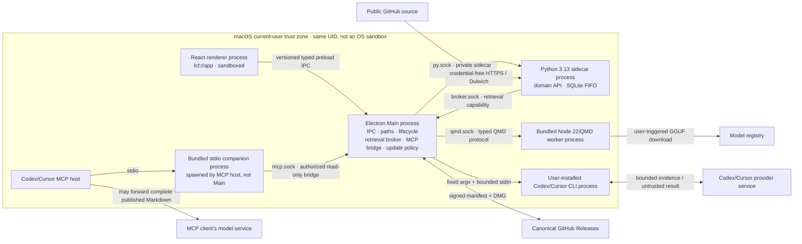

# 系统设计：Electron 本地 Context7 平替

本文是当前 Electron 系统的组合设计视图，解决 ADR、组件 README 和 legacy 文档分散、无法
一眼看清实际运行边界的问题。共享 Wiki 领域流水线的细节见[架构与流水线](01-architecture.md)，
数据实体见[数据模型](05-data-model.md)，当前完成度以
[项目状态快照](development/status.md)为准。

## 1. 范围、状态与术语

设计基线为 `main@fb8bbbc3d0b4e4b5a20c943bd7fd71b2450651a8`，产品版本
`0.3.0-alpha.1`。当前结论是：

> **source merge GO / public release NO-GO**

本文使用四种状态，不能互换：

| 状态 | 含义 |
| --- | --- |
| `implemented-source` | 源码、合同和 source tests 已存在 |
| `validated` | 已在该能力要求的最低真实环境留下可复现证据 |
| `planned` | 已有任务或 ADR，但实现/验证尚未完成 |
| `unsupported` | 当前设计明确不提供，不应被当成缺陷或隐式承诺 |

Accepted ADR 只代表决定已接受；它不自动把能力变成 `validated`。

唯一目标和受支持的产品配置是 **Electron desktop**。Docker/Compose、独立 browser Web、
公开 TCP API、Python HTTP MCP、Host Runner 与 container/GHCR 是仓库中尚未删除的
`deprecated/unsupported legacy`，不再是回退路径，也不承诺迁移或兼容窗口。严格的保留、
拆分和删除清单见 [legacy retirement manifest](development/legacy-retirement.md)。

当前过渡期不得让 Electron 与旧部署写同一数据目录，也不得把 legacy HTTP/API 操作描述成
desktop renderer 拥有的能力。删除支持代码不授权应用或脚本自动删除用户 data/volume/backup。

## 2. 产品目标

Local Context Forge 不是“把代码切块后做向量索引”的工具。它把仓库版本编译成经过审核的
API Wiki：

```text
immutable source snapshot
        ↓
deterministic facts + bounded evidence
        ↓
Codex/Cursor proposal
        ↓
schema + path + line + digest validation
        ↓
human review
        ↓
SQLite published pages + Git audit copy
        ↓
revision-bound QMD hybrid / lexical fallback
        ↓
Context7-compatible read-only MCP
```

核心不变量：

1. query/MCP 只读取已发布内容，不能把 proposal 当正式知识；
2. 生成内容必须能追到不可变 snapshot 的 `source_sha` 和 source refs；
3. provider 开始执行后，未知结果不能自动重放或改用另一个 provider；
4. QMD stale、模型失败或 worker 崩溃时，不得使用旧向量；必须明确返回
   `qmd-bm25` 或 Python `lexical`；
5. renderer 不拥有原始路径、任意网络、进程、凭据、更新器或内部 socket；
6. unknown/legacy data layout 必须 fail closed；应用不自动读取、迁移、覆盖或删除旧数据。

## 3. Electron 运行拓扑



Main 是桌面 capability 仲裁点，不是容纳其他组件的进程容器。Python、QMD、provider CLI 和
companion 都是独立进程；MCP host 负责启动 companion。它们通常与 App 共享同一 macOS UID，
所以 UDS、token、固定 argv 和路径重验只能缩小能力面，不能形成抵御同 UID 恶意进程的 OS
隔离。

图中的外部箭头也是数据边界：

- public GitHub 源码经 Backend 的受控 HTTPS/Dulwich 边界进入；
- provider CLI 使用自己的登录态，把 bounded evidence 发给 Codex/Cursor service；返回内容仍
  按不可信 model output 处理；
- QMD 在用户提交 rebuild 后才从 model registry 下载 GGUF，并在本地处理 Wiki；
- updater 只访问固定 GitHub Release 路径并验证 manifest、signature 和 asset digest；
- 获准的 MCP client 会收到完整 published Markdown，而不只是 snippet，并可能继续把结果发送给
  它自己的模型服务。只读能力限制 mutation，不构成保密边界。

### 3.1 Renderer

Renderer 只负责显示和用户意图：

- 运行于私有 `lcf://app` scheme；
- 禁用 Node integration，启用 context isolation 与 sandbox；
- CSP、导航、新窗口、`webview`、下载和权限请求默认拒绝；
- 不接收 token、socket、PID、原始 stderr、CLI argv、完整本地路径、更新 URL 或公钥；
- Electron renderer 只允许使用 preload bridge。源码中尚存的 browser HTTP transport 是
  deprecated/unsupported 的待拆分分支，不能作为开发、测试或产品回退模式使用。

权威实现：

- `web/src/`
- `desktop/src/main/{window,security,protocol}.ts`

### 3.2 Preload 与 IPC

Preload 是窄适配层，不是通用 Electron API：

- 只公开 `desktop/src/contracts.ts` 定义的类型化方法；
- 对 payload 数量、类型和大小进行第一层约束；
- Main 再做 schema、route、状态和路径策略验证；
- renderer 不能取得 `ipcRenderer`、`shell`、filesystem 或 process 对象。

权威实现：

- `desktop/src/preload/index.ts`
- `desktop/src/contracts.ts`
- `desktop/src/main/{ipc,apiProxy}.ts`

### 3.3 Electron Main

Main 是唯一桌面能力仲裁点，负责：

- 创建和加固窗口；
- 选择并验证本地仓库，发放一次性 opaque grant；
- 启动、探活和停止 Python/QMD；Python 失败后只接受 UI 显式 retry，QMD search 则有独立的
  单次 worker restart/retry 规则；
- broker Python 到 QMD 的检索调用；
- preflight、选择和执行 Codex/Cursor attempt；
- 托管只读 MCP bridge 与 Codex MCP onboarding；
- 固定更新源、manifest 验签、下载缓存和打开 DMG；
- 在响应 renderer 前做稳定错误映射和脱敏。

Main 不是 OS 级沙箱。所有 child 通常与应用处于同一 macOS UID；UDS、mode、owner、
token、capability 和路径重验缩小攻击面，但不声称抵御同 UID 恶意进程。

总装配和关闭顺序以 `desktop/src/main/index.ts` 为准。退出时依次停止 update、MCP bridge、
onboarding、provider、Python sidecar 和 QMD worker；只终止本次记录的进程，不按进程名广泛
kill。

### 3.4 Python sidecar

Python sidecar 是私有 UDS 上的 FastAPI 应用：

- packaged 目标使用 CPython 3.13.14 PyInstaller `onedir`；
- 所有 endpoint，包括 health/handshake，都要求本次启动 token；
- desktop middleware 检查 launch、role、protocol、deadline、schema 和大小；
- renderer 只能经过 Main 的 route allowlist，不能访问私有 provider/admin 能力；
- 领域层拥有 SQLite、队列、snapshot、facts、proposal、review、publish 和查询。

sidecar 内有单消费者、持久 FIFO worker thread。SQLite 是 queue state 的权威记录；sidecar
意外退出后 Main 进入 `failed/canRetry`，不会自行重启，只有用户调用 runtime retry 或重新启动
App 才会创建新进程。新进程启动时 `queued` 保留并继续 FIFO，已经 commit 执行但无确定结果的
provider attempt 进入 `uncertain`，不得自动重放。

权威实现：

- `desktop/src/main/sidecar.ts`
- `backend/app/{cli,desktop_session,factory,service,queue,db}.py`

### 3.5 QMD worker 与 retrieval broker

QMD 不在 renderer 或 Python 进程内运行：

- Main 启动固定 Node 22.23.2 和 QMD 2.5.3 worker；
- QMD startup token 只在 Main 与 worker；
- Python 只得到另一条单次 capability，经 broker 调用 reconcile/search；
- reconcile 提交完整已发布 corpus allowlist，不能只更新前一部分；
- search 必须匹配 corpus revision 和 embedding profile；
- transport/model/stale 异常回退到 Python deterministic lexical；
- embedding 只由用户创建的全局 rebuild job 触发，普通启动、publish 和 lexical query
  不应下载模型；
- hybrid 使用显式 `lex + vec`、`rerank=false`，当前不下载 query expansion/reranker 模型。

QMD 2.5.3 的公共接口不保证物理删除旧 document；允许列表会立即阻止旧 collection 被查询，
但 compact/cleanup 仍是 `planned`。

权威实现：

- `desktop/src/main/{qmdSupervisor,qmdClient,retrievalBroker}.ts`
- `desktop/workers/qmd/`
- `backend/app/desktop_retrieval.py`

### 3.6 Provider attempt

Wiki 默认使用用户已经登录的 Codex CLI。Cursor 仅在用户明确同意
`codex_then_cursor` 且 Codex 在 spawn 前明确为未安装或未登录时可被选择。

```text
Python creates attempt/evidence
          ↓
Main claims attempt
          ↓
signed-layout discovery + auth preflight
          ↓
DB CAS selects provider/executable identity
          ↓
execution_committed_at
          ↓
Main starts exactly one fixed-argv child
          ↓
bounded result → proposal or uncertain
```

spawn、超时、取消、崩溃、输出解析失败或未知结果发生后都不能切到 Cursor。应用不复制 CLI
凭据，不让 renderer 提供 executable 或 argv。

权威实现：

- `backend/app/{provider_attempts,desktop_provider_api,desktop_generation}.py`
- `desktop/src/main/providers/`

### 3.7 MCP companion

Desktop companion 与 legacy `mcp/` 是两个实现：

- desktop companion 随 App 内置，由 MCP host 使用 bundled Node 以 stdio 启动；
- 它不是 Main 的常驻 child；应用必须已经运行；
- companion 从私有 rendezvous 找到本次 Main `mcp.sock`；
- 每次连接由 UI 批准，授权过期、撤销、断连或应用退出即失效；
- 只公开 `resolve-library-id` 和 `query-docs`；
- ingest、review、publish、settings、path、update、model 和 raw file 不在 MCP 接口；
- `query-docs` 最多返回八个命中，并可在 4 MiB bridge 总响应上限内包含每个命中的完整
  published Markdown、source SHA 和 source refs；MCP client 后续如何处理这些内容不由 App
  控制；
- packaged `/Applications` 应用可用固定 argv、安全 discovery 和 ownership ledger
  配置 Codex；Cursor 当前只支持手工 MCP 配置。

持久 pairing、Keychain 和 MCP client code identity 是 `planned`。

权威实现：

- `desktop/companion/`
- `desktop/src/{mcpProtocol,main/mcpBridge,main/mcpSidecarRead}.ts`
- `desktop/src/main/{mcpOnboarding,mcpTargetOwnership}.ts`
- [私有协议](development/mcp-companion-protocol.md)

## 4. 端到端时序

### 4.1 添加本地或私有仓库

1. renderer 调用无参数 `selectLocalSource`；
2. Main 打开 macOS 原生目录选择器；
3. Main 校验 canonical path、owner、symlink、device/inode、home/volume 边界、敏感目录和
   App 数据/cache 重叠；
4. renderer 只收到 `{grantId, displayName}`；
5. grant 为 256-bit、五分钟、单次消费；新选择会撤销旧 grant；
6. 创建 library 时 Main 消费 grant，把真实路径仅写入内部 sidecar payload；
7. Backend 再次按 desktop roots、owner 和敏感目录策略校验；
8. snapshot 与真实 source path 进入私有 App 数据；desktop Main 在响应 Renderer 前过滤本地
   `source`，MCP 也不公开绝对路径。私有 sidecar UDS payload/SQLite 仍保存该路径，legacy HTTP
   API 是另一部署边界，也可能返回 library `source`。

私有仓库必须先由用户自己的 Git/SSH 工具 clone；应用不接收 GitHub token、SSH key 或
Keychain 凭据。

### 4.2 公开远程仓库

1. renderer 提交允许的公开 HTTPS URL；
2. Main route/schema gate 通过后发给 sidecar；
3. Backend 限制 scheme、host、port、redirect、userinfo、大小和 deadline；
4. Dulwich 解析 ref，导出指定 commit 的 immutable snapshot；
5. 不读取宿主 global Git config，不运行 hooks/filter/credential helper。

Desktop packaged 产品不调用系统 Git；测试 fixture 可以使用 C Git 做互操作检查。

### 4.3 采集、生成、审核和发布

1. `POST ingest` 只创建持久 job；
2. 单 worker 取得全局 writer lock，按 FIFO 执行；
3. snapshotter 固定 `source_sha`，拒绝 submodule、LFS pointer、危险路径和超限仓库；
4. facts extractor 生成 manifest、symbol、source ref 和 bounded evidence；desktop 禁用
   ctags，使用内置解析/通用事实；
5. Python 建立 provider attempt，Main 完成唯一一次外部 CLI 执行；
6. 输出经过 JSON/schema、页面路径、source line 和 digest gate；
7. 合格输出成为 proposal，不会立即进入查询；
8. 人工逐页审核；reject 保留审计状态；
9. 每次 approve/publish 都先把该页物化到 Wiki Git 和 SQLite，并把 version 保持为
   `publishing`；这些 partial 页面尚不可查询；
10. 只有全部 proposal 都已 published 且没有 rejected，最后一次批准才原子激活 version、
    更新 `default_version` 并推进 corpus revision；
11. 激活后触发 QMD reconcile；QMD 失败不回滚已发布页面。

SQLite published page 是在线查询权威；Wiki Git 是审计和恢复材料。两者跨介质并非单一 ACID
事务，恢复时必须核对 SQLite、Git commit、page count 和 corpus revision。

### 4.4 查询

1. 查询只扫描已发布版本；
2. 全局查询始终使用 Python deterministic lexical；
3. 指定 library 且 QMD revision/allowlist/health 匹配时，embedding profile ready 使用
   `qmd-hybrid`，否则使用 QMD BM25 lexical；
4. QMD transport、stale gate 或响应校验失败时，明确回退到 Python lexical；
5. 返回结果携带 engine、source refs、bounded snippet 和每个命中的完整 published Markdown；
6. stale index 不能冒充当前 revision。

### 4.5 更换 embedding

1. 用户选择 curated model，或输入允许家族的 `hf:org/repo/file.gguf`；
2. “仅保存”只改变 desired profile，不立即下载；
3. “保存并重建全部”创建全局 FIFO rebuild job；
4. claim 后重新核对 model + corpus revision；
5. worker `update()` 后执行 forced `embed()`；
6. 零错误且 index health 正常时才 CAS 激活 ready；
7. 离线、取消、模型切换、publish race 或 crash 保持 stale/failed；
8. 非向量路径始终可用：健康的 scoped broker 用 QMD BM25，其余用 Python lexical。

当前 custom model 没有独立 publisher signature/fixed digest、可靠 resume 或 shadow-index
atomic swap；完整 `VAL-MODEL-001` 未通过。

### 4.6 更新

1. renderer 只能触发无参数 check/download/open/manual-release-page；
2. Main 只访问固定 repository、channel、arch 和 GitHub host/path；
3. canonical JSON manifest 由 bundle 中 Ed25519 public key 验证；
4. 完整资产名称、大小和 SHA-256 必须匹配；
5. partial 写入私有 update cache，打开前再次检查 owner/mode/link/type/hash；
6. 用户确认后只打开 DMG；
7. 不 mount、不执行 installer、不替换 App、不自动重启；
8. signed 路径不可用时，用户可显式打开固定 Releases 页面；该动作不等于资产已验证。

Automatic apply/install/restart/rollback 当前为 `planned`，且必须先新增或 supersede
[ADR-0011](adr/0011-main-owned-signed-update-client.md)。

## 5. Transport 与身份矩阵

| 调用方 → 被调用方 | Transport | 身份/能力 | 重试规则 | Renderer 可见 |
| --- | --- | --- | --- | --- |
| Renderer → Main | typed Electron IPC | sender/window + exact schema | UI 显式重试 | 稳定结果/错误 |
| Main → Python | private UDS HTTP | per-launch token + launch/role/version | 仅用户显式 retry/relaunch；非幂等不重放 | 无 socket/token |
| Python → Main broker | private UDS HTTP | 独立 broker capability | reconcile 不重放 | 无 |
| Main → QMD | private UDS HTTP | 独立 per-launch token | search transport 可重启一次；reconcile 不重放 | 有限 status |
| Main → CLI | direct fixed argv | signed-layout identity + DB attempt CAS | commit 后不 replay/fallback | provider/status |
| Companion → Main | private MCP UDS | rendezvous + per-connection Main 原生授权 | 断连后重新授权 | Renderer 不可见查询/结果 |
| Main → GitHub update | fixed HTTPS endpoints | Ed25519 manifest + asset digest | 有界网络重试；失败不旁路 | 有限进度/错误 |

所有 UDS 使用系统 per-user temp 下的本次私有目录。token/capability 不写入 argv、环境、磁盘、
renderer、日志或诊断导出。稳定 Application Support 中的 MCP ownership marker 不是 secret，
也不是 bridge capability。

## 6. 数据权威与实际路径

### 6.1 当前实现

| 类别 | 当前路径 | 权威/恢复语义 |
| --- | --- | --- |
| Desktop mutable data | `~/Library/Application Support/Local Context Forge/` | 私有、用户拥有 |
| SQLite | 上述目录的 `metadata.sqlite3` | library/version/default、job/FIFO、proposal/page、runtime settings、embedding state、provider attempt 权威 |
| Snapshot/facts/proposals | `sources/`、`facts/`、`proposals/` | 敏感、版本化 evidence |
| Wiki | `wiki/` | Git 审计副本与 QMD corpus |
| Jobs/locks | `jobs/`、`locks/` | request/control evidence 与 advisory lifecycle |
| Desktop provider evidence | `provider-attempts/<job-id>/` | bounded evidence、schema、prompt、request/result；attempt 状态以 SQLite 为准 |
| Legacy runner compatibility（待删除） | `runner/inbox/`、`runner/outbox/` | 仅供 legacy host runner；先从共享 Settings/service 拆出，再由 ITER-0007 删除 |
| QMD worker DB/state | `qmd/worker/` | 可重建，但需 revision/profile 约束 |
| MCP metadata | `mcp-target-ownership-<scope>.json`、`mcp-rendezvous.json` | ownership ledger 持久且非 secret；rendezvous 是当前 bridge 的短期路径指针 |
| Update downloads | `updates/` | 可重下载；当前位于 Application Support |
| QMD/model cache | `~/Library/Caches/Local Context Forge/qmd-runtime/` | 可重建 |
| Python/QMD/MCP runtime | 系统 temp 的 per-launch 私有目录 | 退出后清理 |
| CLI credentials | Codex/Cursor 自有位置 | App 不复制、不备份 |

### 6.2 已接受目标与当前差距

[ADR-0004](adr/0004-runtime-paths-legacy-data-migration.md) 仍要求更细的 Desktop
`state/libraries/wiki/indexes/backups` 分层、独立日志和更新 DMG 不进入数据备份；其 legacy
input/migration/lifecycle 部分已由
[ADR-0015](adr/0015-electron-only-legacy-retirement.md) 取代。当前只完成 Application Support、
Caches 和 temp 的部分适配：

- 目录结构尚未与 ADR 目标完全一致；
- 没有独立 desktop Logs/doctor/support bundle；
- update DMG 位于 Application Support，手工整目录备份会一并复制；
- desktop backup/restore 没有 manifest/checksum/schema/integrity/物理恢复门禁；
- unknown/legacy layout 的显式拒绝与 fresh/reset UX 尚未实现。

因此“当前路径可用”不能写成 `VAL-DATA-001 pass`。后续不开发 legacy importer；必须建立
desktop-only layout、backup/restore 和 fail-closed reset UX，不能直接搬目录、解释或覆盖旧
`data/`。

## 7. 故障、取消与恢复语义

| 故障 | 规定行为 | 禁止行为 |
| --- | --- | --- |
| Main/sidecar 启动或运行失败 | 进入 `failed/canRetry`，仅接受用户显式 retry/relaunch | 自动重启或发现系统 Python/Node 兜底 |
| child 在非幂等请求中退出 | attempt/job 标记 uncertain 或失败 | 自动重放 |
| Codex 执行后失败 | 用户决定是否创建新 attempt | 自动切 Cursor |
| QMD stale/崩溃 | 不使用旧向量；按健康状态返回 `qmd-bm25` 或 Python `lexical` | 返回旧 vector 冒充当前 |
| embedding 中断 | 保持 stale/failed，不激活部分结果 | 继续标记 ready |
| publish 后 QMD 失败 | 保留已发布页面，稍后显式 reconcile | 回滚用户已审核内容 |
| App 未运行时 MCP | 明确失败 | companion 偷启第二套 writer |
| update 验签/摘要失败 | 删除或隔离 partial，停止 | 打开旁路 DMG/ZIP |
| local source 被移动/删除 | 明确不可用，重新选择/修复 | 猜测新路径 |
| 发现 unknown/legacy layout | 拒绝启动该数据根，提示使用 fresh/current desktop data | 猜测 schema、原地升级、覆盖或自动删除 source |

超时只代表调用者停止等待，不必然证明同步 Backend handler 已停止；后续需要对长任务硬取消、
child 退出确认和 packaged lifecycle 做物理观察。

## 8. Electron 目标与待删除 legacy surface

| 维度 | 保留的 Electron desktop | 待删除 legacy surface |
| --- | --- | --- |
| UI transport | preload → Main | browser HTTP |
| Python | bundled sidecar 目标 | API container |
| QMD | bundled Node worker 目标 | API container 内 QMD |
| MCP | bundled stdio companion → Main | HTTP/stdio gateway → API |
| Provider | Main 执行本机 CLI | host runner spool；可选 Ollama |
| 本地仓库 | native picker + opaque grant | 显式 imports/root mount |
| 网络监听 | desktop 不公开 HTTP TCP | 默认 loopback 8000/8001/8080 |
| 数据根 | Application Support | `LOCAL_DATA_DIR`，默认 `./data` |
| 安装 | 将来的 reviewed DMG | `./install.sh` / `install.command` |
| Windows 4060 | 不支持远程 worker | Ollama helper；无替代、直接退出 |

右栏当前仍存在于仓库，但已经 unsupported；必须在左栏逐能力门禁通过后删除。领域模型、Wiki
pipeline 和 React UI 是左栏的共享实现，不能随 legacy 外壳一起删除。

## 9. 代码所有权地图

| 组件 | 责任 | 主要路径 |
| --- | --- | --- |
| Desktop assembly | 进程、路径、生命周期 | `desktop/src/main/index.ts` |
| Desktop trust | window、protocol、IPC | `desktop/src/main/{window,security,protocol,ipc,apiProxy}.ts` |
| Python transport | UDS、token、handshake | `desktop/src/main/sidecar.ts`、`backend/app/desktop_session.py` |
| Domain | queue、DB、library、review/query | `backend/app/{service,queue,db,factory}.py` |
| Source/Wiki | snapshot、facts、Git audit | `backend/app/{source,facts,wiki,validation}.py` |
| Provider | attempt、discovery、execution | `backend/app/*provider*`、`desktop/src/main/providers/` |
| Retrieval | QMD worker/broker/fallback | `desktop/workers/qmd/`、`desktop/src/main/qmd*`、`backend/app/desktop_retrieval.py` |
| MCP | companion、bridge、onboarding | `desktop/companion/`、`desktop/src/main/mcp*` |
| Update/release | signed client、packaging | `desktop/src/main/update*`、`desktop/scripts/`、`.github/workflows/desktop-release.yml` |
| Renderer | Electron React UI；后续移除 browser fetch fallback | `web/src/` |
| Legacy removal candidates | Compose、Nginx/Web container、public TCP/CORS、HTTP MCP、host runner、container CI | `docker-compose.yml`、`docker/`、`web/{Dockerfile,nginx.conf}`、`mcp/`、`host_runner/`、`scripts/lcf`、`.github/workflows/container-images.yml` |
| Governance | ADR、迭代、证据、TODO | `docs/adr/`、`docs/development/`、`TODO.md` |

## 10. 能力边界

### Implemented-source，仍需真实门禁

- sandboxed renderer、typed IPC、private UDS；
- bundled Python/Node/QMD build/audit policy；
- Dulwich source/Wiki 路径；
- persistent FIFO、provider attempt/CAS/no replay；
- local embedding profile、forced rebuild、hybrid/fallback；
- MCP companion 与 Codex onboarding source policy；
- local repository opaque grants；
- signed update client 与两阶段 Release workflow。

### Planned

- desktop-only 完整路径布局和 desktop backup/restore；
- unknown/legacy layout fail-closed 与显式 fresh/reset UX；
- fixed model publisher digest/signature、可靠 resume、cache eviction、shadow index；
- QMD physical compaction；
- durable MCP pairing/Keychain/client identity；
- security-scoped bookmark、fd-based snapshot 或 App Sandbox；
- automatic update apply/install/restart/rollback；
- diagnostics/support bundle；
- fixed evaluation corpus、增量 Wiki 生成；
- Electron capability cutover、共享代码解耦和 legacy deploy/transport/release/docs 删除；
- permanent `VAL-LEGACY-ABSENCE-001` gate。

### Unsupported

- Intel Mac、Windows/Linux desktop；
- notarization、hardened runtime、Apple Developer ID 等价信任；
- renderer 直接 HTTP/文件/进程/更新能力；
- desktop Ollama 或远程 Windows worker；
- Cursor 自动 MCP onboarding；
- MCP 写操作或自动启动 App；
- desktop query expansion/reranker；
- packaged 产品依赖系统 Git/ctags/Python/Node/QMD。

## 11. 变更规则

修改本设计涉及的任何边界时：

1. 读 `AGENTS.md`、活动迭代和相关 Accepted ADR；
2. 若改变架构、安全、数据、打包或发布决定，先新增 superseding ADR，不改写历史决定；
3. 更新活动迭代的 scope/task/risk/evidence；
4. 更新[追踪矩阵](development/traceability.md)的 REQ、owned paths 和 VAL；
5. 先跑 focused tests，再跑受影响的 aggregate gate；
6. packaged/physical 未运行必须写 `not-run` 和原因；
7. 更新[状态快照](development/status.md)和[TODO](development/todo.md)，避免多个入口产生
   不同事实。

完整开发流程见[开发者手册](development/contributor-handbook.md)。
